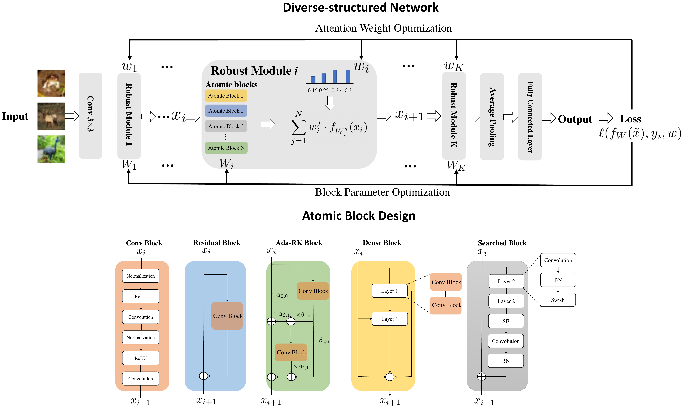

# DS-Net

Code accompanying the paper  
***Learning Diverse-Structured Networks for Adversarial Robustness*** [paper](https://arxiv.org/abs/2102.01886)  
<!-- -->
<p align="center">
    
</p>
<p align="center">

## Abstract
In *adversarial training* (AT), the main focus has been the objective and optimizer while the model has been less studied, so that the models being used are still those classic ones in *standard training* (ST). Classic *network architectures* (NAs) are generally worse than searched NAs in ST, which should be the same in AT. In this paper, we argue that NA and AT cannot be handled independently, since given a dataset, the optimal NA in ST would be *no longer optimal* in AT. That being said, AT is time-consuming itself; if we directly search NAs in AT over large *search spaces*, the computation will be practically infeasible. Thus, we propose a *diverse-structured network* (DS-Net), to significantly reduce the size of the search space: instead of low-level operations, we only consider predefined *atomic blocks*, where an atomic block is a time-tested building block like the residual block. There are only a few atomic blocks and thus we can weight all atomic blocks rather than find the best one in a searched block of DS-Net, which is an essential trade-off between *exploring* diverse structures and *exploiting* the best structures. Empirical results demonstrate the advantages of DS-Net, i.e., weighting the atomic blocks.

## Requirements
+ Pytorch==1.7.0, torchvision==0.8.1
+ Python==3.8.5
+ [AutoAttack](https://github.com/fra31/auto-attack)

## Training and Evaluation

**On CIFAR-10 and SVHN:**

```
python train_ds_net.py --gpu x --start_evaluation 0 --note xxx --factor 4 --init_channel 20 --trades_beta 6 --is_trades 0 --is_mart 0 --is_at 0 --epsilon 0.031 --is_softmax 1 --is_normal 1 --use_amp 1 --epochs 120 --step_size 0.007 --seed xx
```
+ Use "is_trades", "is_at" and "is_mart" to switch among three adversarial training styles.

+ Use "start_evaluation" to specify which epoch you would like to start evaluation.

+ Use "is_softmax" to determine whether the attention weights should be learned.

+ Use "is_normal" and so on to select the initialization for the attention weights.

+ Use "use_amp" to determine whether you would like to use mixed precision training. To use mixed-precision training, follow the apex installation instructions [here](https://github.com/NVIDIA/apex#quick-start)

+ Adversarial training detailes can be selected by changing "trades_beta", "epsilon", "epochs", "step_size", etc.

+ DS-Net detailes can be selected by changing "factor" and "init_channel".

## Citation
If you use any part of this code in your research, please cite our [paper](https://arxiv.org/abs/2102.01886):
```
@article{du2021dsnet,
  title={Learning Diverse-Structured Networks for Adversarial Robustness},
  author={Du, Xuefeng and Zhang, Jingfeng and Han, Bo and Liu, Tongliang and Rong, Yu and Niu, Gang and Huang, Junzhou and Sugiyama, Masashi},
  journal={ICML},
  year={2021}
}
```